# Z.Design — Showcase

Complete, self-contained landing pages generated end-to-end by **Z.Design**. Each design is a single standalone HTML file (open it directly in any browser) with **real AI-generated photography** (MiniMax `image-01`), bespoke art-directed typography, and a palette chosen for the brand — never generic templates, stock burgers, or broken links.

> Every example below is the raw model output: HTML + inline CSS + generated imagery, bundled to be durable (images live in [`examples/images/`](examples/images), so they never expire).

---

## Diverse verticals — real generated imagery

### Casa Verde — Boutique Jungle Lodge
A luxury rainforest lodge. Cormorant Garamond over an earthy jungle-green / terracotta palette, real generated infinity-pool, canopy and spa stills. *Atmosphere > noise.*
[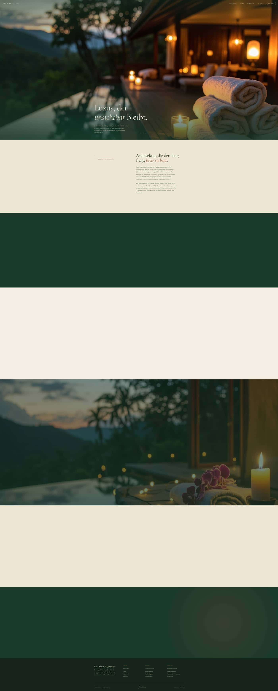](examples/casa-verde-jungle-lodge.html) · **[Open →](examples/casa-verde-jungle-lodge.html)**

### Iron Temple — Strength Gym
A brutalist powerlifting gym. Anton / Oswald condensed type, concrete-grey with a single warning-yellow accent, an authentic athlete-mid-lift hero. *Loud, raw, on-brand.*
[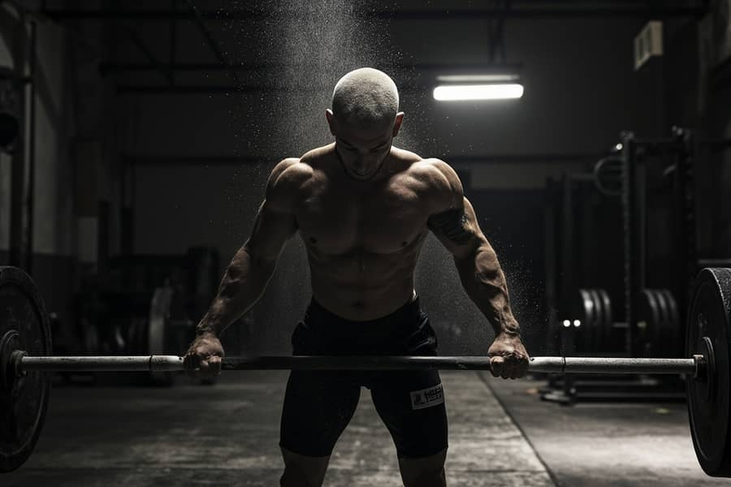](examples/iron-temple-strength-gym.html) · **[Open →](examples/iron-temple-strength-gym.html)**

### Ember & Smoke — Cocktail Bar
A moody speakeasy. Playfair Display Black Italic over near-black with warm brass and blood-burgundy, dramatic single-source lighting on smoked drinks.
[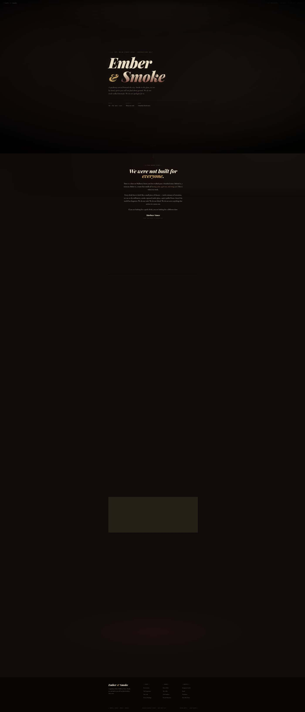](examples/ember-smoke-cocktail-bar.html) · **[Open →](examples/ember-smoke-cocktail-bar.html)**

### Nordic Light — Coffee Roasters
A Scandinavian specialty roaster. Fraunces editorial serif, espresso-brown on warm cream, macro coffee-crema and bean photography. *Magazine craft.*
[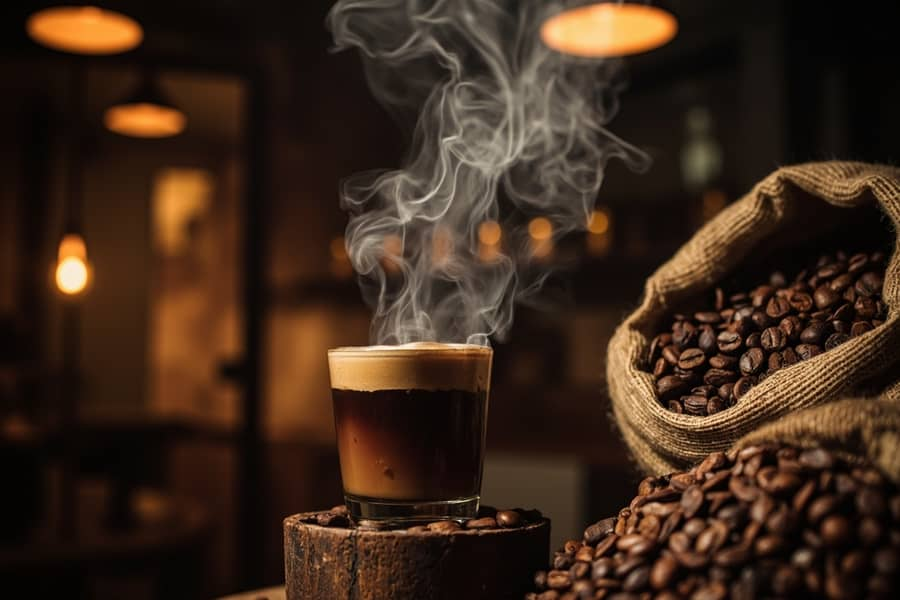](examples/nordic-light-coffee-roasters.html) · **[Open →](examples/nordic-light-coffee-roasters.html)**

### Fougère — Botanical Studio
A wild-floral design studio. DM Serif Display over moss-green and ivory, hand-tied bouquet and lush-greenery imagery with a paper-grain feel.
[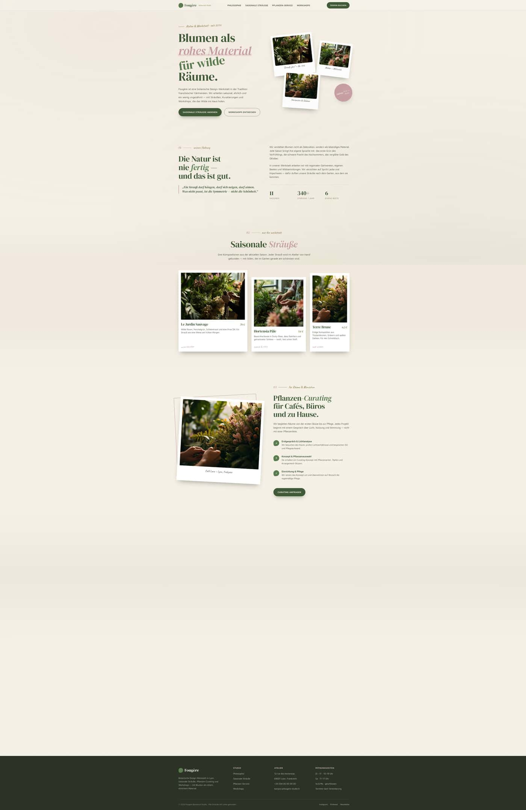](examples/fougere-botanical-studio.html) · **[Open →](examples/fougere-botanical-studio.html)**

### Saltbreak — Surf Co
A sun-bleached coastal brand. Bebas Neue poster type over faded sand / teal / coral, generated dawn-wave and coastline action.
[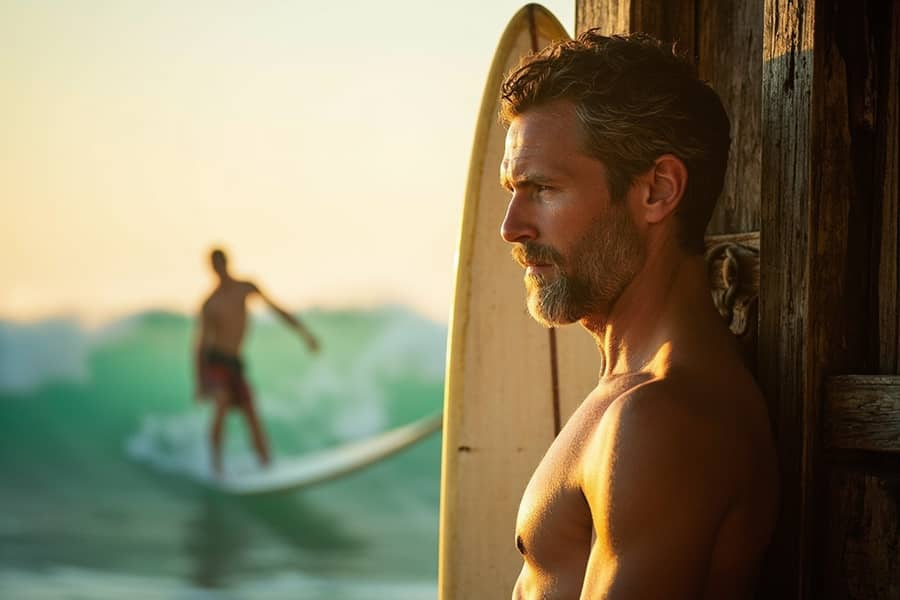](examples/saltbreak-surf-co.html) · **[Open →](examples/saltbreak-surf-co.html)**

---

## Craft & trade verticals (generated WITH the memory system)

*Generated through the batch pipeline with the negative-memory brain wired in: every design received the 7 bootstrapped anti-slop avoids + domain recall, and passed the `validateDesignHtml` QC gate.*

### Holzwerk Manufaktur — Tischlerei
High-end carpentry for custom solid-wood furniture. Cormorant + Inter over oak / walnut / linen — warm, crafted, honest.
[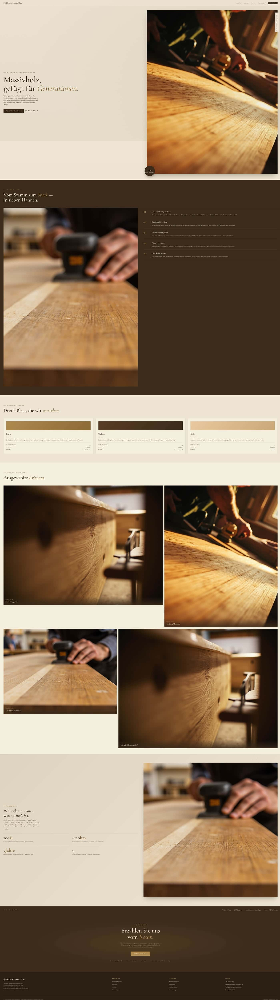](examples/holzwerk-manufaktur-tischlerei.html) · **[Open →](examples/holzwerk-manufaktur-tischlerei.html)**

### Linienraum — Architekten
A minimal architecture studio for residential & cultural builds. Archivo grotesk over concrete-grey / ink — strict, reduced, documentary.
[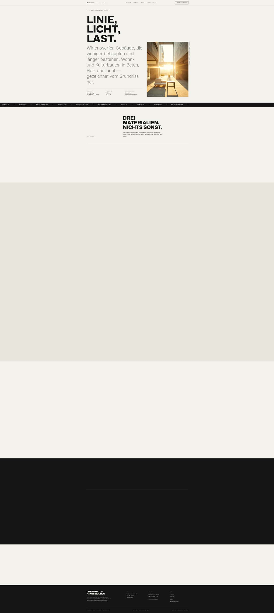](examples/linienraum-architekten.html) · **[Open →](examples/linienraum-architekten.html)**

### Pulse — Performance Coaching
Premium data-driven personal training. Anton condensed over black + neon-lime — high-energy, clinical-precise.
[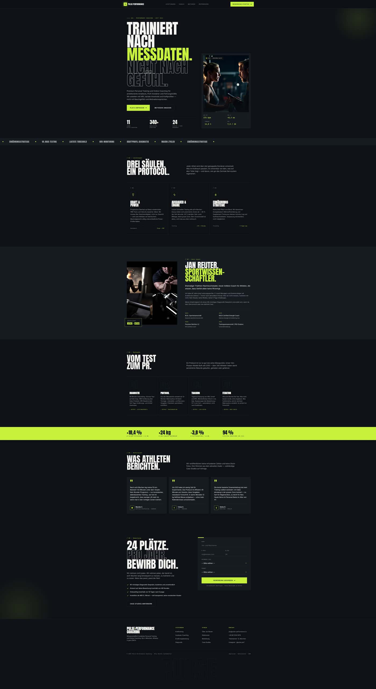](examples/pulse-performance-coaching.html) · **[Open →](examples/pulse-performance-coaching.html)**

### Blütenwerk — Floristik
A wild-floral atelier for seasonal bouquets & weddings. DM Serif Display over moss / dusty-rose / ivory — soft, natural, handmade.
[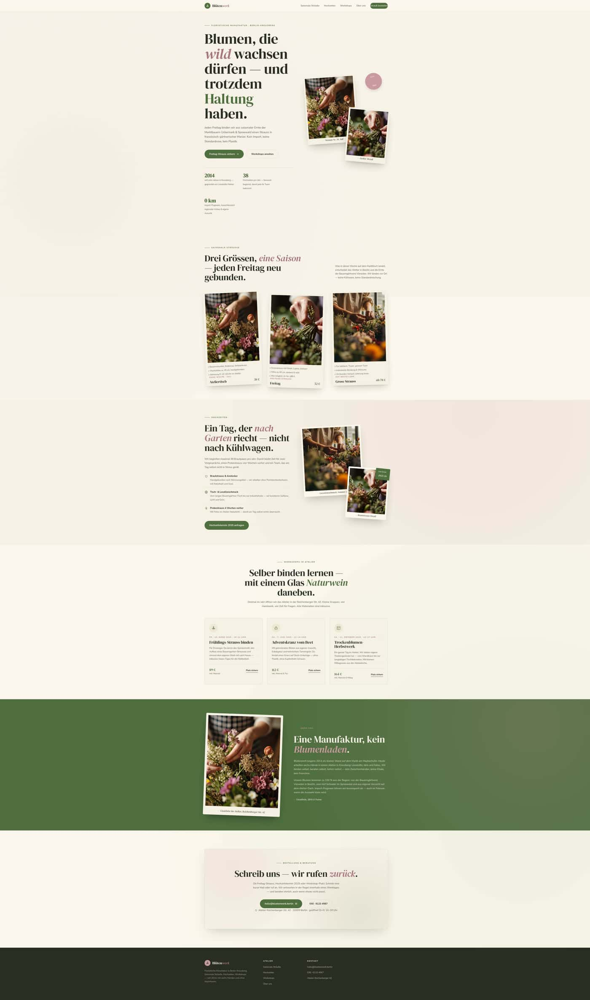](examples/bluetenwerk-floristik.html) · **[Open →](examples/bluetenwerk-floristik.html)**

---

## Thai street-food — MiniMax food photography

The original vertical where Z.Design first proved real generated imagery: every dish is a photorealistic MiniMax `image-01` render, generated for the specific concept before the page is built (no stock, no burgers).

[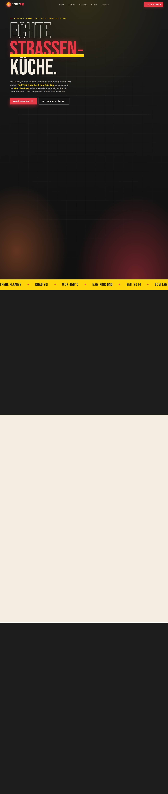](examples/thai-imbiss-street-fire.html) · **[Street Fire →](examples/thai-imbiss-street-fire.html)**

[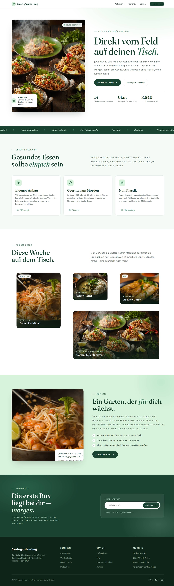](examples/thai-imbiss-tropical-pop.html) · **[Fresh Garden →](examples/thai-imbiss-tropical-pop.html)**

Also: [Temple Dark](examples/thai-imbiss-temple-dark.html)

---

### How these are made

Z.Design's batch pipeline (`/api/design/batch`) runs the full stack per design:
1. **Real imagery first** — 3 MiniMax `image-01` photos generated from subject-aware prompts *before* the page prompt, then injected as the only allowed `` sources.
2. **Art-directed generation** — GLM-5.2 builds a complete, responsive, accessible HTML/CSS doc using a bespoke palette and real Google-Font stacks (Fraunces, Cormorant, Anton, Playfair, Bebas Neue…).
3. **No slop** — an anti-slop guard rejects the generic defaults (indigo/violet gradients, emoji icons, left-accent cards); lorem-ipsum and placeholder content are blocked.

The result: agency-level, production-ready pages across completely different verticals — each with its own visual identity, not a reskinned template.
