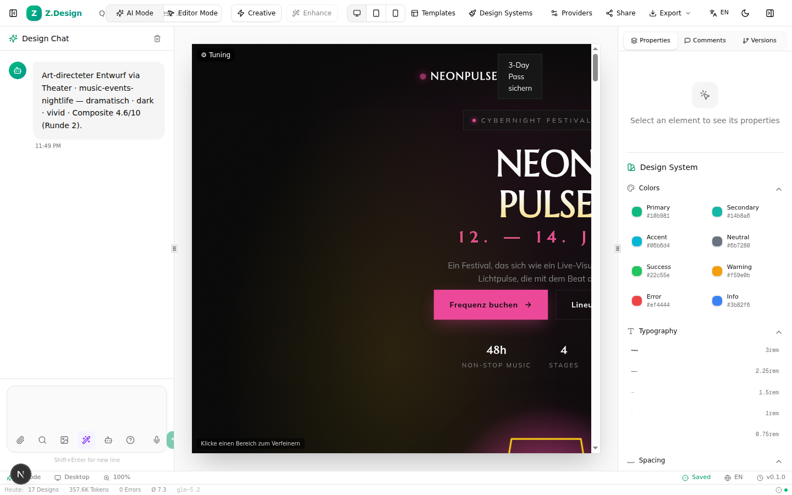

# Z.Design — Autonomous AI Design Agent

> **Local-first, open-source design platform that generates agency-level web designs from natural language.**
> Inspired by Claude Design + OpenDesign + Hermes Agent.



## What is Z.Design?

Z.Design is an AI-powered design platform that doesn't just "generate a webpage" — it **thinks like an art director**, runs a **6-panelist critique theater**, **audits** every design for accessibility/SEO/performance, and **learns from its own successes** to get better over time.

## Key Features

| Feature | What it does |
|---|---|
| 🎨 **Creative-Director** | Generates 3 distinct, bold concepts (with named design exemplars) before generating — not template-first |
| 🎭 **6-Panelist Critique Theater** | Designer / Critic / Brand / A11y / Copy / Konzept-Fidelity — weighted composite, ≤3 convergence rounds |
| 🛡️ **Anti-Slop Linter** | Deterministic detection of the 7 cardinal AI-design sins (indigo gradients, emoji icons, lorem, etc.) |
| 🔍 **5-Audit Loop** | Accessibility + SEO + Performance + Design-Rhythm + Content — with **auto-fix** (contrast, alt-text, meta tags) |
| 🧠 **Self-Improving Skills** | Learns winning recipes per topic → patches them → reloads as baseline (Hermes-inspired) |
| 🎛️ **Post-Gen Sliders** | Hue / spacing / font-scale / radius — instant CSS variation without regeneration |
| 🎯 **Surgical Refine** | Click any section → refine only that part |
| 🔌 **MCP Server** | External agents (Claude Code, etc.) can drive Z.Design programmatically |
| 📊 **Observability** | Token tracking, error logging, rate-limit monitoring |
| 🗣️ **Voice Input** | GLM-ASR-2512 (plan-native, no extra cost) |

## Quick Start

```bash
git clone https://github.com/Ralle1976/z-design.git
cd z-design/Projekt
bun install

# Configure your Z.ai API key
echo "ZAI_API_KEY=your-key-here" > .env.local
echo "ZAI_BASE_URL=https://api.z.ai/api/anthropic" >> .env.local
echo "ZAI_MODEL=glm-5.2" >> .env.local
echo "DATABASE_URL=file:./db/custom.db" >> .env.local

# Initialize database
bun run db:push

# Start
bun run dev  # → http://localhost:3000
```

## How It Works (30-second version)

1. Type a prompt (e.g., "Thai Imbiss")
2. The Creative-Director generates **3 distinct concepts** (not color swaps — different creative directions)
3. Pick a concept
4. The agent runs: **Generate → Lint → 6-Panelist Theater → Refine → Audit → Self-Improve**
5. See the result in the canvas, adjust with sliders, refine surgically
6. Export as HTML

## Architecture

See [Architecture](Architecture.md) for the full pipeline diagram.

## License

**Polyform Noncommercial 1.0.0** — free for personal use, no commercial use.
